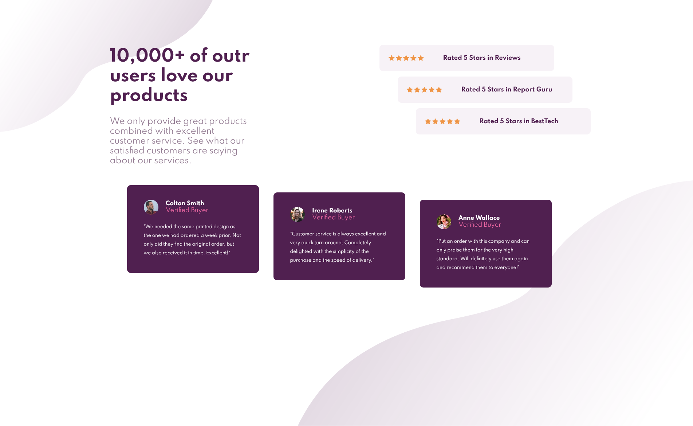

# Frontend Mentor - Social Proof Section solution

This is a solution to the [Social Proof Section challenge on Frontend Mentor](https://www.frontendmentor.io/challenges/social-proof-section-6e0qTv_bA/hub/social-proof-section-htmlcss-7YLopYD3o). Frontend Mentor challenges help you improve your coding skills by building realistic projects. 

## Table of contents

- [Overview](#overview)
  - [Built with](#built-with)
- [Author](#author)

## Overview

- Live Site URL: [Social Proof Section](https://frontendmentor-newbie.github.io/02.social-proof-section/)
- Solution: [Frontendmentor.io](https://www.frontendmentor.io/solutions/social-proof-section-htmlcss-7YLopYD3o)
- Challenge: [Hub](https://www.frontendmentor.io/challenges/social-proof-section-6e0qTv_bA/hub/social-proof-section-htmlcss-7YLopYD3o)

### Built with

- Semantic HTML5 markup
- CSS custom properties
- Flexbox
- Mobile-first workflow

## Author
- Frontend Mentor - [@Nahuel-P](https://www.frontendmentor.io/profile/Nahuel-P)
- Twitter - [@Nahuel__P](https://twitter.com/Nahuel__P)

